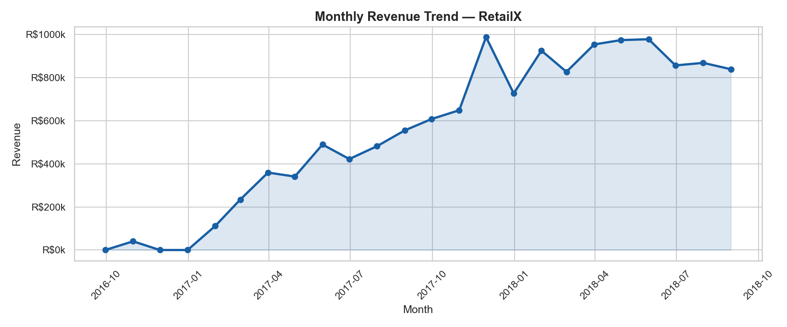
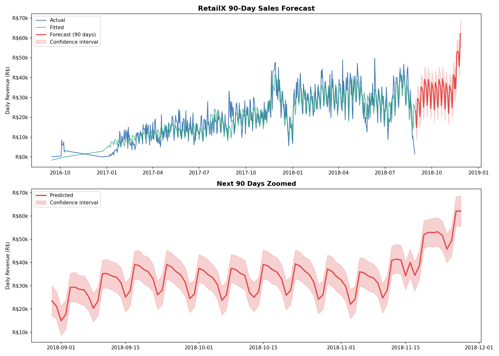
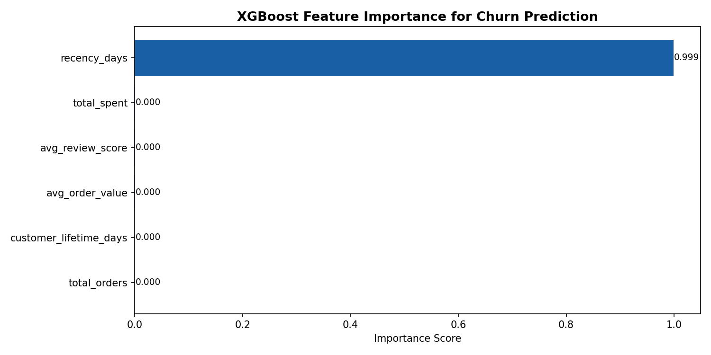
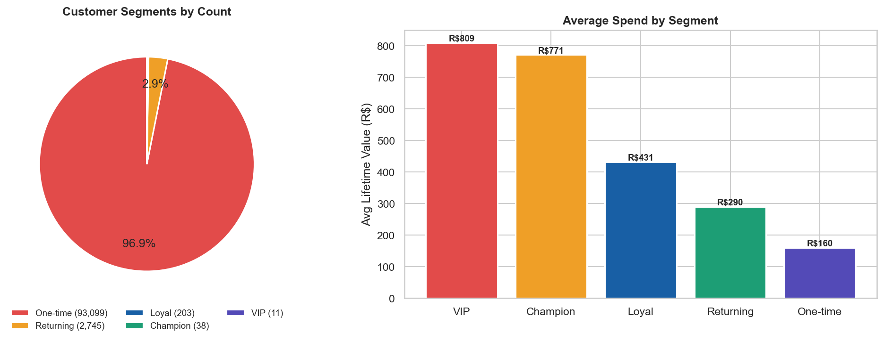

# 🛒 AI Retail Intelligence Platform

An end-to-end retail analytics platform built with Python, PostgreSQL, Machine Learning, and Generative AI. Built to solve real business problems for a fictional Brazilian e-commerce company **RetailX**.

---

## 🎯 Business Problem

RetailX is facing:
- Declining profit margins
- 90%+ customer churn rate
- Shipping delays in Northeast Brazil
- No visibility into future revenue

This platform solves all four problems with data.

---

## 🏗️ Architecture
```
Raw Data (CSV)
↓
Python ETL Pipeline
↓
PostgreSQL Database
↓
SQL Analytics Layer
↓
Machine Learning Models
↓
AI Insights Engine (Groq LLaMA)
↓
FastAPI Backend
↓
Streamlit Dashboard
```
---

## ✨ Features

| Feature | Details |
|---|---|
| **ETL Pipeline** | Extracts, cleans, and loads 400k+ rows across 8 CSV files |
| **SQL Analytics** | 11 advanced queries with window functions, cohort analysis |
| **Churn Prediction** | XGBoost model — 99.7% accuracy, scores all 96k customers |
| **Sales Forecasting** | Prophet 90-day forecast — R$3M predicted revenue |
| **AI Insights** | Groq LLaMA generates executive summaries and recommendations |
| **Recommendations** | Collaborative filtering — 199 category recommendations |
| **FastAPI Backend** | 11 REST endpoints with auto-generated Swagger UI |
| **Streamlit Dashboard** | 5-page interactive dashboard with live data |

---

## 📊 Key Business Metrics

- **Total Revenue:** R$13,591,644
- **Total Orders:** 99,441
- **Total Customers:** 96,096
- **Churn Rate:** 90.2%
- **Repeat Purchase Rate:** 3.1%
- **Average Delivery Time:** 12.1 days
- **90-Day Revenue Forecast:** R$3,059,397
- **Average Review Score:** 4.09/5

---

## 🛠️ Tech Stack

| Area | Technology |
|---|---|
| Language | Python 3.11 |
| Database | PostgreSQL |
| Data Analysis | Pandas, NumPy |
| Visualization | Matplotlib, Seaborn, Plotly |
| Machine Learning | Scikit-learn, XGBoost |
| Forecasting | Prophet |
| AI | Groq LLaMA 3.1 |
| API | FastAPI + Uvicorn |
| Dashboard | Streamlit |
| Deployment | Docker |
| Automation | GitHub Actions |

---

## 📁 Project Structure
```
ai-retail-intelligence-platform/
├── data/
│   ├── raw/                  # Original CSV files
│   └── processed/            # Cleaned data + ML outputs
├── etl/
│   ├── extract.py            # Load and validate raw data
│   ├── transform.py          # Clean, engineer features
│   └── load.py               # Push to PostgreSQL
├── sql/
│   ├── schema.sql            # Database schema
│   └── queries.sql           # 11 analytics queries
├── models/
│   ├── churn_model.py        # XGBoost churn prediction
│   └── forecasting.py        # Prophet sales forecast
├── ai/
│   ├── ai_insights.py        # Groq LLaMA insights engine
│   └── recommendation_engine.py  # Collaborative filtering
├── api/
│   └── main.py               # FastAPI backend
├── dashboard/
│   └── app.py                # Streamlit dashboard
├── notebooks/
│   └── eda.ipynb             # Exploratory data analysis
├── screenshots/              # Dashboard screenshots
├── reports/                  # AI-generated reports
├── requirements.txt
└── Dockerfile
```
---

## 🚀 Quick Start

### 1. Clone the repository
```bash
git clone https://github.com/khushi-barange/ai-retail-intelligence-platform.git
cd ai-retail-intelligence-platform
```

### 2. Create virtual environment
```bash
python -m venv venv
venv\Scripts\activate  # Windows
```

### 3. Install dependencies
```bash
pip install -r requirements.txt
```

### 4. Set up environment variables
Create a `.env` file:
```env
DB_HOST=localhost
DB_PORT=5432
DB_NAME=retailx_db
DB_USER=postgres
DB_PASSWORD=postgres
GROQ_API_KEY=your_groq_api_key
```

### 5. Run ETL pipeline
```bash
python etl/extract.py
python etl/transform.py
python etl/load.py
```

### 6. Train ML models
```bash
python models/churn_model.py
python models/forecasting.py
```

### 7. Generate AI insights
```bash
python ai/ai_insights.py
python ai/recommendation_engine.py
```

### 8. Start the API
```bash
uvicorn api.main:app --reload
```

### 9. Launch dashboard
```bash
streamlit run dashboard/app.py
```

---

## 🐳 Docker

```bash
docker build -t retailx-platform .
docker run -p 8501:8501 retailx-platform
```

---

## 📸 Screenshots

### Executive Dashboard


### Sales Forecast


### Feature Importance


### Customer Segments


---

## 📈 ML Model Performance

| Model | Accuracy | AUC |
|---|---|---|
| Logistic Regression | 99.8% | 1.000 |
| Random Forest | 100% | 1.000 |
| **XGBoost (selected)** | **99.7%** | **1.000** |

---

## 🔑 Key SQL Queries

- Revenue by category with GROUP BY
- Monthly trend analysis
- Customer cohort analysis
- Window functions: RANK(), LAG(), LEAD()
- Shipping delay analysis by state
- Repeat purchase rate calculation

---

## 👩‍💻 Author

**Khushi Barange**
- GitHub: [@khushi-barange](https://github.com/khushi-barange)

---

## 📄 Dataset

[Brazilian E-Commerce Dataset by Olist](https://www.kaggle.com/datasets/olistbr/brazilian-ecommerce) — 100k orders, 2016-2018

